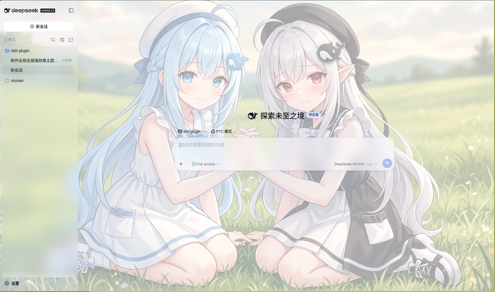
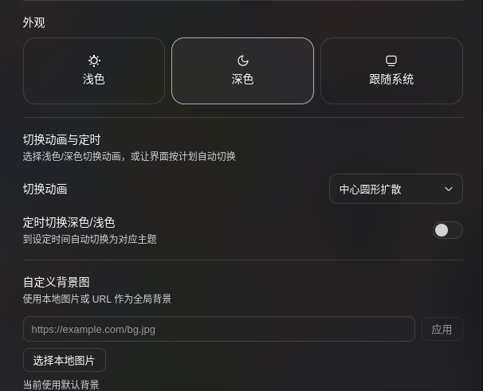

# dsh-client-ui-frosted-glass

为 dsh Web UI 提供的**全局毛玻璃（frosted glass / backdrop blur）主题插件**。它不改变现有浅色/深色偏好，而是在任意主题之上叠加一层半透明表面 token 覆盖与全局 backdrop-filter 模糊，让整个界面呈现 iOS/macOS 风格的磨砂玻璃质感。

此外，插件在「设置 → 通用设置」的**外观**下方新增一行「切换动画与定时」：

- **切换动画**：无动画 / 淡入淡出 / 中心圆形扩散 / 从上向下扫过，点击浅色/深色时全屏过渡。
- **定时切换**：可分别设置每天自动切到深色与浅色的时间（24 小时制）；到点自动切换，手动切换会保留到下一个时间点。
- **自定义背景图**：可输入图片 URL，或选择本地图片（自动压缩后保存在浏览器本地），一键恢复默认背景。

## 截图

## 效果构成

插件由两半组成（都在浏览器端生效）：

1. **全局样式表**（lib/client.js 内联注入）
   - 在 body 上铺一层 bg.jpeg 背景（cover 铺满并居中，base64 内联，源文件在 assets/bg.jpeg），浅色显示原图、深色叠加半透明深色遮罩压暗，作为模糊的“背后内容”。
   - 给外壳三栏框架以及浮层（menu / dialog / listbox / tooltip 等 role）施加 backdrop-filter 模糊。
   - 把内置遮罩模糊 token --dsw-mask-blur 从 blur(2px) 加强，使弹窗/图片遮罩也更“玻璃”。

2. **半透明表面 token 覆盖**（通过 ctx.theme.overrideTokens）
   - 把 --dsw-alias-bg-base、--dsw-alias-bg-layer-1/2/3、--dsw-alias-bg-overlay、--dsw-specific-sidebar-fill、--dsw-specific-menu 等背景 token 改成半透明 rgba，每个都带 light / dark 双色。
   - 因为所有组件都通过 var(--dsw-*) 取色，这一层与 class 名无关，即使外壳重建后 hash 变化，半透明效果依然成立。

3. **主题切换动画**
   - 包装 ctx.theme.setTheme，使用浏览器原生 View Transition API：由浏览器对切换前后的**真实页面画面**分别截图，把新画面作为蒙版淡入 / 从点击位置圆形扩散 / 从上向下扫过，无纯色填充、过渡无缝。
   - 尊重 `prefers-reduced-motion`；系统偏好不变时（如选择「跟随系统」但解析结果相同）直接切换；不支持 View Transition API 时降级为即时切换。

4. **定时浅色/深色切换**
   - 在设置行中开启后，按「深色开始时间」和「浅色开始时间」安排下一个边界定时器；到点调用同一套动画切换逻辑。
   - 设置存放在用户设置文档的 `ui-theme` 段（`frosted*` 前缀字段），随 profile 持久化。

5. **自定义背景图**
   - URL 背景写入 `ui-theme.frostedBackgroundUrl`；本地图片压缩后写入 `localStorage`，避免 settings.yaml 塞入数 MB 的 base64。
   - 两者通过 body 上的 `--frosted-bg-image` 变量生效，覆盖插件内置的默认背景；恢复默认时移除该变量。

## 目录结构

    dsh-client-ui-frosted-glass/
    ├── package.json          # dsh.bundle（自插入行）+ dsh.client（浏览器半）
    ├── cordis.patch.yml      # bundle 补丁：向组合插入 ui-frosted-glass 行
    ├── lib/
    │   ├── index.js          # 宿主半（空 apply，仅为出现在 Loader 中）
    │   └── client.js         # 浏览器半（window.__ModuleLoader__.load 打包格式）
    ├── README.md
    └── README.zh.md

lib/client.js 是手写的浏览器打包产物（与 tsdown 产出的 window.__ModuleLoader__.load({ id, factory }) 格式一致），无需本地构建步骤即可直接使用。

## 安装

先克隆本仓库，再通过 profile 的插件管理安装到 web profile：

    git clone https://github.com/makuralymi/dsh-webUI-Glass-Theme.git
    dsh plugin --profile web add ./dsh-webUI-Glass-Theme

该命令会在 profile 目录内执行 pnpm 安装，并因包声明了 dsh.bundle.patch 而自动把它加入 dsh.profile.bundles，其 bundle 补丁会自动插入 ui-frosted-glass 行，无需再手动改 cordis.patch.yml。随后：

    dsh --profile web
    # 或
    dsh web

> 提示：宿主组合在启动时构建，新增/移除插件需**重启 web 进程**后刷新页面才会生效。

### 手动安装（不依赖 dsh plugin）

以下方式与上面的 dsh plugin 二选一，不要同时使用（会重复插入同一行）。适合不方便运行 dsh plugin 的场景：

1. 把本目录安装为 profile 依赖：

    cd "$DSH_HOME/profiles/web"
    pnpm add <克隆下来的仓库路径，例如 ./dsh-webUI-Glass-Theme>

2. 在 $DSH_HOME/profiles/web/cordis.patch.yml 中追加一行：

    - insert:
        - id: ui-frosted-glass
          name: 'dsh-client-ui-frosted-glass'

## 验证

- 启动后浏览器应看到三栏外壳及其上的浮层呈现半透明磨砂效果，浅色/深色切换都生效。
- 打开开发者工具，确认 head 里存在 style[data-plugin="dsh-client-ui-frosted-glass"]，且 body 内联了 --dsw-alias-bg-base 等半透明 token。
- body[data-ds-dark-theme] 会切换深色渐变与深色半透明 token。
- 「设置 → 通用设置 → 外观」下方出现「切换动画与定时」；选择动画后点击浅色/深色，能看到对应的全屏过渡。
- 开启定时后设置深色/浅色时间，到时间点会自动切换；配置持久化在 `$DSH_HOME/settings.yaml` 的 `ui-theme.frosted*` 字段。
- 「自定义背景图」中输入 URL 或选择本地图片后，body 的 `--frosted-bg-image` 会立即更新；点击「恢复默认」后回到内置背景。

## 自定义

- 模糊强度：改 lib/client.js 中的 --frosted-blur（默认 20px）与 --frosted-saturate（默认 180%）。
- 背景图：替换 assets/bg.jpeg 后重新内联（或改 lib/client.js 里的 --frosted-bg-image data URI）；深色压暗强度改 body[data-ds-dark-theme] 里 linear-gradient 的 alpha。
- 半透明度：改 FROSTED_TOKENS 里各 token 的 rgba alpha 值。
- 需要更彻底的“全局”覆盖时，可继续往 FROSTED_TOKENS 里加 --dsw-alias-bg-* / --dsw-specific-* token。
- 动画速度：改 lib/client.js 中 CSS 变量 `--frost-vt-duration`（默认 340ms）。
- 动画曲线：改 CSS 变量 `--frost-vt-easing`。
- 默认时间：改 lib/client.js 中 SETTINGS_DEFAULTS 的 frostedDarkTime / frostedLightTime。
- 本地图片压缩：改 `compressImage` 的 `maxDimension`（默认 2560）与 `quality`（默认 0.86）。

## 已知限制

- 外壳框架与输入框（composer）的 backdrop-filter 通过稳定的 data-* 属性选择（:has(> [data-shell-overlay]) 与 [data-composer-card]），不依赖构建 hash；浮层走 role 选择器，半透明 token 覆盖同样与 class 名无关。
- 第三方主题 token 覆盖是运行时叠加层，不做完整性校验；这里刻意只覆盖“表面背景”类 token，文本/状态 token 保持可读。